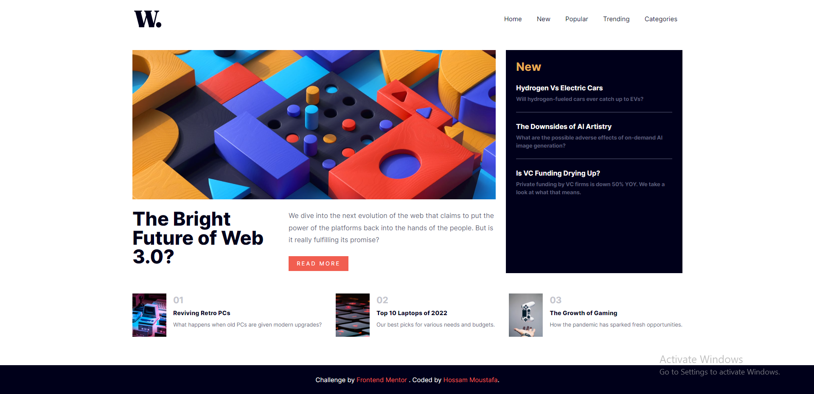

# Frontend Mentor - News homepage solution

This is a solution to the [News homepage challenge on Frontend Mentor](https://www.frontendmentor.io/challenges/news-homepage-H6SWTa1MFl). Frontend Mentor challenges help you improve your coding skills by building realistic projects.

## Table of contents

- [Overview](#overview)
  - [The challenge](#the-challenge)
  - [Screenshot](#screenshot)
  - [Links](#links)
- [My process](#my-process)
  - [Built with](#built-with)
  - [What I learned](#what-i-learned)
  - [Continued development](#continued-development)
  - [Useful resources](#useful-resources)
- [Author](#author)

## Overview

### The challenge

Users should be able to:

- View the optimal layout for the interface depending on their device's screen size
- See hover and focus states for all interactive elements on the page

### Screenshot

### Links

- Solution URL: [https://github.com/hossammoustafa404/news-page.git]
- Live Site URL: [https://news-page1.netlify.app/]

## My process

### Built with

- Semantic HTML5 markup
- CSS custom properties
- Flexbox
- [React](https://reactjs.org/) - JS library
- [Styled Components](https://styled-components.com/) - For styles
- [Bootstrap](https://getbootstrap.com/) - Frontend toolkit
- [React-Bootstrap](https://react-bootstrap.github.io/components/alerts/)

### What I learned

I have learned how to set image src depending on the screen size.

### Continued development

I am going to practice more to get perfect file structure in react.
I am going to practice grid system in bootstap and how to customize components.

### Useful resources

- [w3schools](https://www.w3schools.com/tags/att_source_srcset.asp) - I have learned how to set image src depending on the screen size.
  with the help of this website.

- [stackoverflow](https://stackoverflow.com/questions/30460681/changing-image-src-depending-on-screen-size) - I have learned how to set image src depending on the screen size.
  with the help of this website.

- [stackoverflow](https://stackoverflow.com/questions/24193272/overflow-xhidden-on-mobile-device-not-working) - It hepled me to know that overflow-x: hidden; does not work in smartpjone browesrs when i use it with "boy tag".

## Author

- Github - [Hossam Moustafa](https://github.com/hossammoustafa404)
- Frontend Mentor - [@hossammoustafa](https://www.frontendmentor.io/profile/hossammoustafa404)
- Facebook - [@myname22744](https://www.facebook.com/myname22744)
